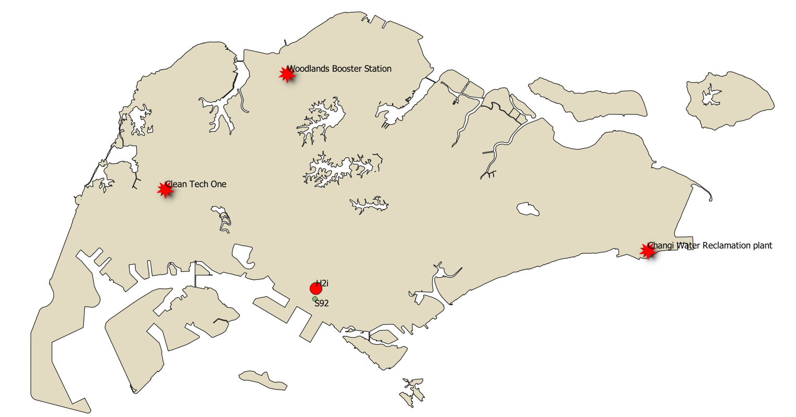
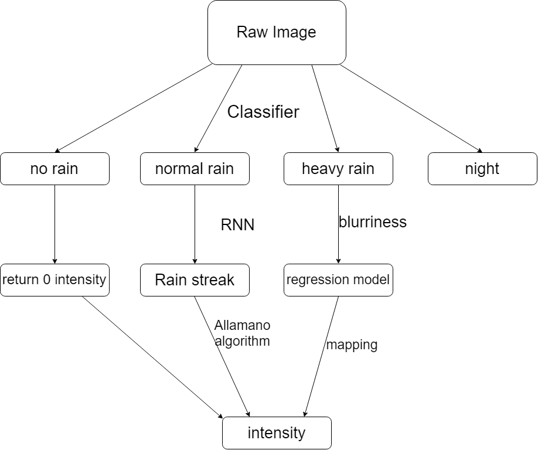
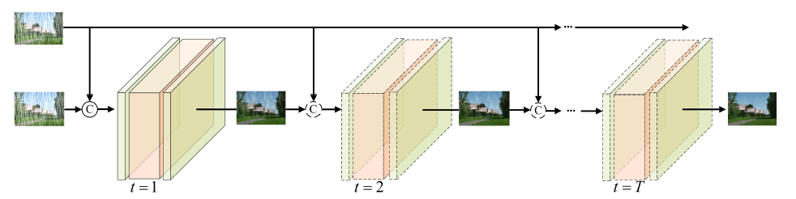

# Rainfall Camera
---

<figure>

</figure>

## _Contents_

### 1. [Introduction](#introduction)
### 2. [Classifier](#classifier)
### 3. [Normal Rainfall Processing](#normal)
### 4. [Heavy Rainfall Processing](#heavy)
### 5. [Night Image Processing](#night)
### 6. [Reference](#reference)
### 7. [Misc](#misc)
#### 7.1 [To-do List](#todo)
#### 7.2 [Updates](#update)

## _Introduction_

<figure>
     
    <caption style="font-size:1em;">
**Fig.1 Flow Chart for Rainfall Camera**
</caption>
</figure>

## _Classifier_

1. Model Description:

> The model built for classifying rainfall images is [SVM](https://medium.com/machine-learning-101/chapter-2-svm-support-vector-machine-theory-f0812effc72), which in general, seperate datapoints with hyperplanes. The reason why we build a relatively light model is for the sake of computational time. The simplest and robust way is what we seek for.

2. Data Acquisition:

> To build such machine-learning model, we still need information to train it. With four categories we want to specify, 100 images inside each category are selected from the streaming videos. Image size to train is confined with (300,300).

3. Information to support:

> With data, how can we translate image into useful information that we can feed into SVM? By considering the characteristics during night, rainy days, heavy rainfall and sunny days, I came up with five informative descriptions: contrast, brightness, sharpness, hue and saturation.

4. Return:

> After implementing this classifier, we are able to get a assigned probability of each category for single image. 

## _Normal Rainfall Processing_
   **1. RNN**

   <figure>
    
   <caption style="font-size:1em;">
**Fig.2 Overview of RNN model** (Progressive Image Deraining Networks: A Better and Simpler Baseline)
</caption>
   </figure>
    
   **2. Allamano Algorithm**

   <figure>
    
   <caption style="font-size:1em;">
**Fig.3 Example of delineated rain streaks** 
</caption>
   </figure>
    
   
   > Allamano Algorithm is used for evaluating the rainfall intensity, the philosophi behind is control volume approach to count rain drops inside the defined bounding box, and calculate rainfall terminal velocity etc.

## _Heavy Rainfall Processing_

    So far, we are limited by the data available to supervise a model towards the "correct" path
    will add once more data can be aquired

## _Night Image Processing_

## _Reference_

R. Dongwei, Z. Wangmeng etc. (2019) _Progressive Image Deraining Networks: A Better and Simpler Baseline_  
R. Martin and M. Frank (2008.) _Classification of Weather Situations on Single Color Images_   
P. Allamano, A. Croci, and F. Laio1 (2015) _Toward the camera rain gauge_  

## _Miscellaneous_

### To-do list
- [x] build dask task manager
- [x] add classifier
- [ ] add regression model/convert to RGB image
- [ ] night image processing
- [ ] GUI
- [x] add visualization
- [ ] add computational time table
- [ ] GPU version(convert all dask array to torch array and hard code torch version SVM)

### Updates
    
    2019.4.19 add visualization.py
    2019.4.18 optimized code and retrained model
    2019.4.17 dask implementation
    2019.4.15 trained a classifier model
  
