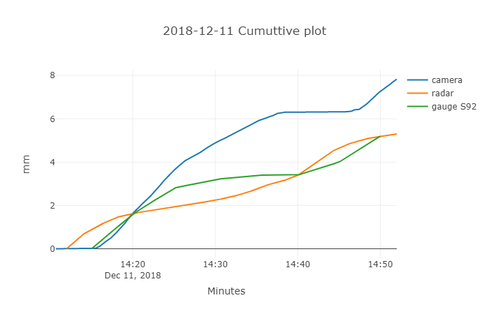

# Rainfall Camera
---

<figure>


</figure>

## _Contents_

### 1. [Introduction](#introduction)
### 2. [Classifier](#classifier)
### 3. [Normal Rainfall Processing](#normal)
#### 3.1 [Model Description](#description)
#### 3.2 [Model Efficiency](#efficiency)
### 4. [Heavy Rainfall Processing](#heavy)
### 5. [Night Image Processing](#night)
### 6. [Validation](#validation)
### 7. [Reference](#reference)
### 8. [Misc](#misc)
#### 8.1 [Demo](#demo)
#### 8.2 [To-do List](#todo)
#### 8.3 [Updates](#update)


## _Introduction_<a name='introduction'></a>

<p align="center">
  <br>
   Fig.1 Flow Chart of Rainfall Camera
</p>

## _Classifier_<a name='classifier'></a>

1. Model Description:

> The model built for classifying rainfall images is [SVM](https://medium.com/machine-learning-101/chapter-2-svm-support-vector-machine-theory-f0812effc72), which in general, seperate datapoints with hyperplanes. The reason why we build a relatively light model is for the sake of computational time. The simplest and robust way is what we seek for.

2. Data Acquisition:

> To build such machine-learning model, we still need information to train it. With four categories we want to specify, 100 images inside each category are selected from the streaming videos. Image size to train is confined with (300,300).

3. Information to support:

> With data, how can we translate image into useful information that we can feed into SVM? By considering the characteristics during night, rainy days, heavy rainfall and sunny days, I came up with five informative descriptions: contrast, brightness, sharpness, hue and saturation.

4. Return:

> After implementing this classifier, we are able to get a assigned probability of each category for single image. 


## _Normal Rainfall Processing_<a name='normal'></a>

### _Model Description_<a name='description'></a>

Follow the pipeline, we emphisize on how to extract the rainfall intensity. In this method we describe, we feed the classified rainy image denoted as R into 4 times pretrained recurrent neuron network to get the original de-rained image O. By simple substracting and binary thresholding, we are able to get rainfall streaks S for analysis. But according to experiment, some images still quite messy under the condition that the moving trees and some hight pixel values give a false signal. In order to safeguard the following calculation process, we need to provide more accurate rainfall streaks. By achieving this, we decompose S with PCA and analyse the morphology of rain streaks etc. the shape of rain streak, the width of the rain streak, the orientation of the rain streak. With provided constraints, the output purified image will eventually put into Allamano algorithm.


<p align="center">
  <br>
    Fig.2 Pipeline of normal rainfall process
</p>


   **1. RNN**<hr style="height:10px; visibility:hidden">
   
   <p align="center">
   <br>
   Fig.3 Overview of RNN model (Progressive Image Deraining Networks: A Better and Simpler Baseline)
   </p>
   <br>
   
   **2. Allamano Algorithm**<hr style="height:10px; visibility:hidden">

   <p align="center">
   <br>
   Fig.4 Example of delineated rain streaks
   </p>

   <br>
   
   > Allamano Algorithm is used for evaluating the rainfall intensity, the philosophi behind is control volume approach to count rain drops inside the defined bounding box, and calculate rainfall terminal velocity etc.
   > 
   
   an event on 2018.12.08 demonstrates the accuracy of this series of images.

   <p align="center">
    <br>
    Fig.5 Event 2018.12.12 at H2i, Singapore
   </p>

### _Model Efficiency_<a name='efficiency'></a>

|Object|Total Elapsed Time|Average Elapsed Time per Image|GPU_CPU|Cores or Threads|
|------|------------------|------------------------------|-------|---------|
|2018.04.01|1.12 hours|1.30 seconds|GPU|8
|2018.12.08|0.45 hours|0.91 seconds|GPU|8
|2018.12.11|0.71 hours|1.03 seconds|GPU|8
|2018.12.12|1.15 hours|1.34 seconds|GPU|8

## _Heavy Rainfall Processing_<a name='heavy'></a>

    So far, we are limited by the data available to supervise a model towards the "correct" path
    will add once more data can be aquired

## _Night Image Processing_<a name='night'></a>

Some modern techniques goes here. 


## _Validation_<a name='validation'></a>

We have three data sources to validate our camera accuracy, first are three radars located in the northern, eastern and western part of Singapore. Another sources are 83 rain gauges densely distributed in Singapore. To bear in mind, the nearest rain gauges is still 300 meters away, and radar averages surroundings by 700 meters by 700 meters median filter. These two biases indicate that none of the two are convincible, and no updates will be given before some in-site measurement is placed right with camera.

   <p align="center">
   <br>
   Fig.6 Time Series Plot of One Event<br>
   <br>
   Fig.7 Cumulative Time Series Plot of One Event<br>
   </p>
    

## _Reference_<a name='reference'></a>

R. Dongwei, Z. Wangmeng etc. (2019) _Progressive Image Deraining Networks: A Better and Simpler Baseline_  
R. Martin and M. Frank (2008.) _Classification of Weather Situations on Single Color Images_   
P. Allamano, A. Croci, and F. Laio1 (2015) _Toward the camera rain gauge_  

## _Miscellaneous_<a name='misc'></a>

### _Demo_<a name='demo'></a>

In the api folder, there is a simple demo classifying an image and extract the rainfall intensity with built [Flask](http://flask.pocoo.org/) backend

```python  
python api.py  
```

a local server should be set up at port 8000, in your browser, enter in localhost:8000, then the interface will pop up as 

   <p align="center">
   <br>
   Fig.5 Snapshot of the local server
   </p>

   <br>

### _To-do list_<a name='todo'></a>
- [x] build dask task manager
- [x] add classifier
- [x] Flask server
- [ ] Host on cloud
- [ ] add regression model/convert to RGB image
- [ ] night image processing
- [ ] GUI
- [x] add visualization
- [ ] add computational time table
- [ ] GPU version(convert all dask array to torch array and hard code torch version SVM)
- [ ] Validation with radar and rain gauges

### _Updates_<a name='update'></a>
    
    2019.4.24 Optimize codes to speed up.
    2019.4.22 Flask local server to classify image 
    2019.4.19 add visualization.py
    2019.4.18 optimized code and retrained model
    2019.4.17 dask implementation
    2019.4.15 trained a classifier model
  
