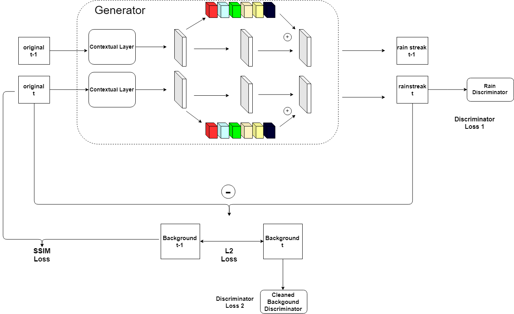

# Training Tracking

This repo basically tracks the training process of the my rainGAN.

The architecture will follow soon...

    
    <FIGCAPTION>Figure1. Framework of proposed RainGAN</FIGCAPTION>

Table1. Training of RainGAN

|date|model|# params|epoches|loss function|model name|log_dir|index|
|----|-----|--------|-------|-------------|----------|-------|-----|
|2019.6.10|Rain Generator+Rain Discriminator+ Background Discriminator| |500|MSE (G)+2*D_Loss|generator-6-10|RainGAN-benchmark|1|
|2019.6.11|Modified Generator+Rain Discriminator+Background Discriminator| |500|MSE+2*D_loss|generator-6-11|RainGAN-modified_GAN|2|
|2019.6.12|Modified Generator+Rain Discriminator+Background Discriminator|23M|500|ssim+l1_loss+2*D_loss|generator-6-12|ssim-gan|3|
|2019.6.13|Modified Generator+Rain Discriminator+Background Discriminator|23M+72K+83K|500|G loss +D loss|generator-6-13, D-rain-6-13, D-bg-6-13|ssim-gan|4|

### Improvement

- [x] Add ssim loss
- [x] Add BatchNorm to avoid blowing
- [x] Make Discriminator trained  (Why? because discriminator sometimes make false justification)

## Update

### 2019.6.11

Model Index 1: Rain Generator+ Rainstreak discriminator+ background discriminator.

Obviously, the model is not learned during the process and the loss is fluctuated between 2 and 3. This is mainly due to the rainstreak generator doesn't produce meaningful results and the rain discriminator justifies it as false. It is thus important to modify the network instead.

Model Index 2: Modified Generator+ Rainstreak discriminator+ background discriminator.

Previous version of generator does not work properly because wrongly defined dilated layer. Thus rain streak is not detected, black backgound instead.

### 2019.6.12 

Model Index 3: It is found that the generator outputs background with noises rather than what we expect. To prevent this, I constrained another loss function - SSIM - which compares background and rainy image because the similarity will to some extent tell a story.

Fails, the model converges to erase everything from rain streaks

### 2019.6.13

Model Index 4: Made truly generative adversarial network

### 2019.6.17

I think it's better to pre-train generator first in order to accelerate the model performance. In such sense, I prepared 100 synthetic images to train, and use GAN model to fine-train.