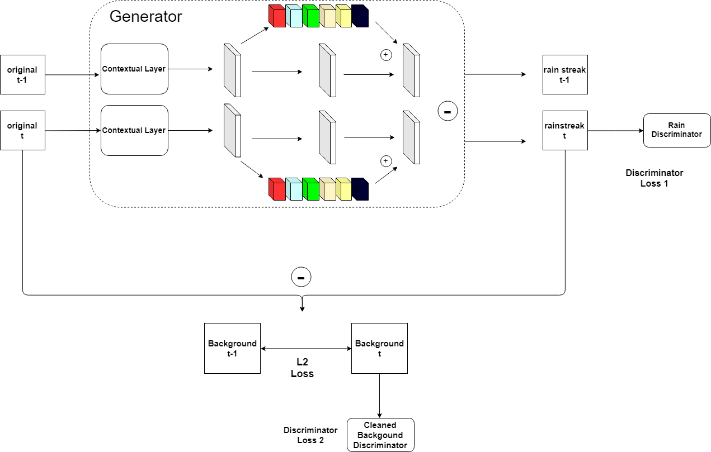

# Training Tracking

This repo basically tracks the training process of the my rainGAN.

The architecture will follow soon...

    
    <FIGCAPTION>Figure1. Framework of proposed RainGAN</FIGCAPTION>

Table1. Training of RainGAN

|date|model|epoches|loss function|model name|log_dir|notes|index|
|----|-----|----:---|-------:------|------:----|----:---|--:---|----|
|2019.6.10|Rain Generator+Rain Discriminator+ Background Discriminator|500|MSE (G)+2*D_Loss|generator-6-10|RainGAN-benchmark|bsize:2|1|
|2019.6.11|Modified Generator+Rain Discriminator+Background Discriminator|500|MSE+2*D_loss|generator-6-11|RainGAN-modified_GAN|bsize 2|2|

### Improvement

- [] Make Discriminator trained  

## Update

### 2019.6.11

Model Index 1: Rain Generator+ Rainstreak discriminator+ background discriminator.

Obviously, the model is not learned during the process and the loss is fluctuated between 2 and 3. This is mainly due to the rainstreak generator doesn't produce meaningful results and the rain discriminator justifies it as false. It is thus important to modify the network instead.

Model Index 2: Modified Generator+ Rainstreak discriminator+ background discriminator.

Previous version of generator does not work properly because wrongly defined dilated layer. Thus rain streak is not detected, black backgound instead.